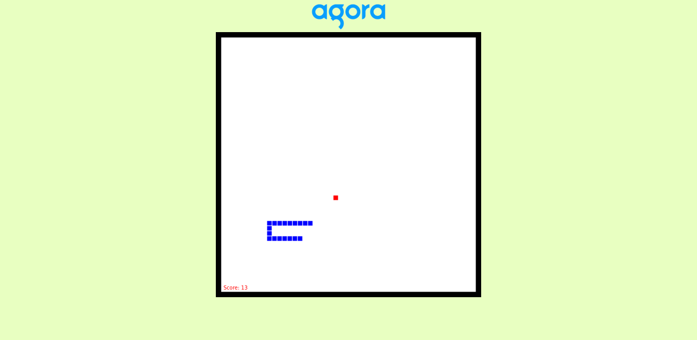

# Intro to JS

This particular folder contains the code for the workshop conducted on November 2nd, 2020. This code explains on how to build a snakes and ladder game using JS.

## How the resources work

* <strong>index.html</strong><br>Here you will find the HTML code for the home page
* <strong>main.css</strong> <br>
Here you will find the CSS styling for the home page
* <strong>script.js</strong><br>Here you will find the code for JS library: JQuery.
* <strong>Agora Intro to JS.pptx</strong><br>Contains the slides used during the workshop.


## Instructions to run
* Clone the repo 
```bash
git clone https://github.com/Meherdeep/Events-And-Workshops
```
* Navigate to the file `Index.html` inside the folder `Intro to JS`

```bash
Run the index.html file for the responsive website
```

## Result



